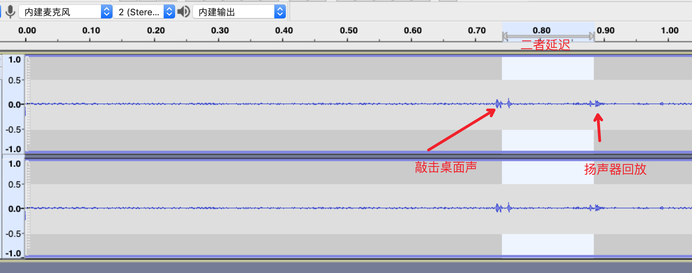

tinyalsa

## 音频延迟调试工具 | tinyktv
### 使用说明
Usage: ./tinyktv [-D capture_card] [-d capture_device] -D2 play_card -d2 play_device [-c channels] [-r rate] [-b bits] [-p period_size] [-n n_periods]

-D 麦克风所在声卡编号
-d 麦克风的节点号
-D2 扬声器所在声卡编号
-d2 扬声器的节点号
-c 声道数，大部分设备都只支持双声道，一般填2
-r 采样率，大部分设备只支持48000采样率，一般填48000
-p 每个周期采样大小
-n 每个采样周期采样次数

其中-p 和 -n 2个参数的值的乘积越小理论延迟越低，但过低的值可能无法得到足够的CPU时间片导致XRUN（严重时人耳可感知）。

### 使用方法

本仓库包含已编译好的arm和x86等常见android架构的可执行文件（位libs目录），可以直接下载使用。示例：

```
# 安装
adb root
adb remount
adb push tinyktv /data/

# 调用
adb shell /data/tinyktv -D 0 -d 0 -D2 -d2 0 -c 2 -r 48000 # -D -d -D2 -d2的参数值需要根据实际设备的情况来调整
```

### 声卡选择
可以通过如下命令查看当前设备中的全部声卡，例如

```
$adb shell ls /dev/snd|grep pcm
pcmC0D0c
pcmC0D0p
```
输出结果中的最后一个字符代表是麦克风还是扬声器节点（c=capture，p=play），C后面的数字值声卡编号，D后面的数字指节点号


## 延迟测量
通过tinyktv命令，可以将麦克风录制的音频实时通过扬声器播放出去，从录制到播出的延迟可以通过任意录音软件进行测量。这里以Audacity（跨平台、开源工具）测量为例进行说明，步骤如下：
1、选择相对安静的环境进行下面步骤
2、按照tinyktv工具的使用说明在Android设备中执行
3、电脑打开Audacity软件，点击红色的录音按钮开始录音
4、按照截图方式计算延迟



